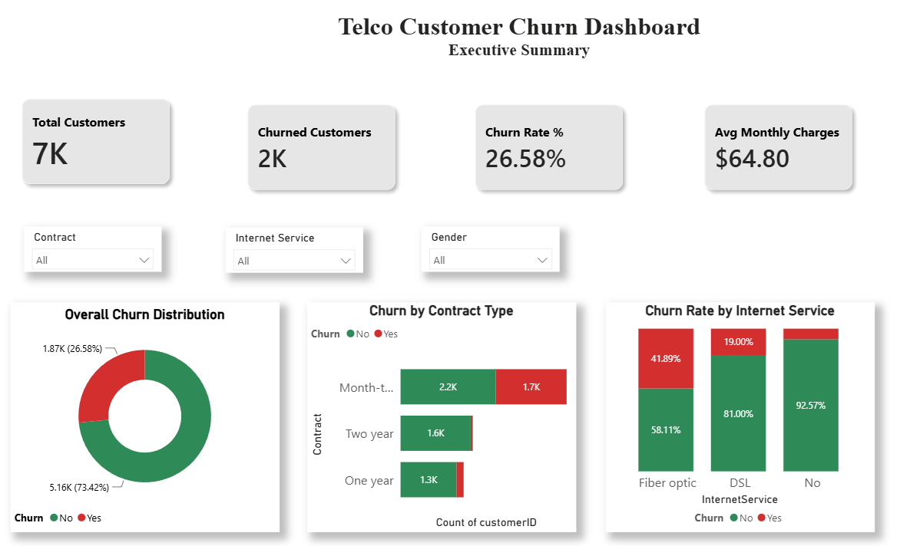
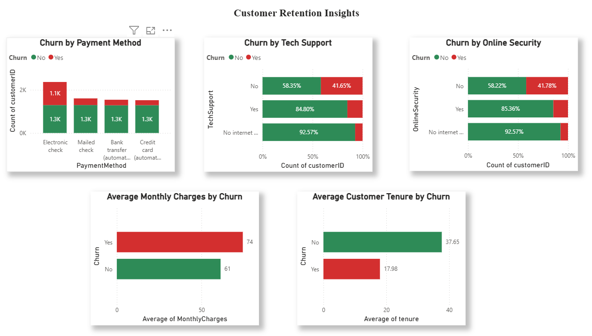

# 📊 Telco Customer Churn Analysis & Prediction


An end-to-end Data Analytics and Machine Learning project that analyzes customer churn patterns, predicts customer attrition, and presents actionable business insights through an interactive Power BI dashboard.

---

# 🚀 Project Highlights

- 📈 Analyzed **7,032 telecom customer records** to identify customer churn patterns.
- 🧹 Performed comprehensive **data cleaning, preprocessing, and feature engineering**.
- 📊 Conducted detailed **Exploratory Data Analysis (EDA)** to uncover business insights.
- 🤖 Built and compared **Logistic Regression** and **Random Forest** classification models.
- 🎯 Achieved **80.38% Accuracy** and **0.845 Cross-Validation ROC-AUC** using Logistic Regression.
- 📉 Designed an **interactive Power BI dashboard** with KPIs, slicers, and retention insights.
- 💡 Generated actionable business recommendations to improve customer retention.

---

# 📊 Dashboard Preview

## Executive Dashboard



---

## Customer Retention Drivers



---

# 📌 Project Overview

Customer churn is one of the biggest challenges for subscription-based businesses. Losing existing customers directly impacts revenue and increases customer acquisition costs.

This project analyzes customer behavior using the **IBM Telco Customer Churn Dataset**, identifies the key drivers of churn, builds predictive machine learning models, and presents business insights through an interactive Power BI dashboard.

The project combines:

- 📊 Exploratory Data Analysis (EDA)
- 🤖 Machine Learning
- 📈 Power BI Dashboard
- 💼 Business Recommendations

to support data-driven decision making.

---

# 💼 Business Problem

Telecommunication companies continuously lose customers due to contract cancellations.

The objectives of this project are to:

- Understand customer churn behavior.
- Identify the major churn drivers.
- Build predictive machine learning models.
- Compare model performance.
- Recommend strategies to improve customer retention.

---

# 🎯 Project Objectives

- Clean and preprocess raw customer data.
- Perform exploratory data analysis.
- Engineer features for machine learning.
- Train and evaluate multiple classification models.
- Build an interactive Power BI dashboard.
- Generate actionable business recommendations.

---

# 📂 Dataset Information

**Dataset:** IBM Telco Customer Churn Dataset

| Item | Value |
|------|------|
| Original Records | 7,043 |
| Original Features | 21 |
| Target Variable | Churn |
| Removed Records | 11 |
| Final Dataset | 7,032 Customers |

---

# 📁 Project Structure

```text
telco-customer-churn-analysis/
│
├── data/
│   ├── raw/
│   │   └── telcochurn.csv
│   │
│   └── processed/
│       ├── telco_churn_clean.csv
│       └── telco_churn_ml.csv
│
├── notebooks/
│   ├── 01_EDA.ipynb
│   └── 02_Machine_Learning.ipynb
│
├── models/
│   ├── logistic_regression.pkl
│   └── scaler.pkl
│
├── powerbi/
│   └── Telco_Customer_Churn_Analysis.pbix
│
├── images/
│   ├── executive_dashboard.png
│   └── customer_retention_insights.png
│
├── reports/
│   └── model_comparison.csv
│
├── README.md
├── requirements.txt
└── .gitignore
```

---

# 🛠️ Tools & Technologies

### Programming

- Python

### Libraries

- Pandas
- NumPy
- Matplotlib
- Seaborn
- Scikit-learn

### Business Intelligence

- Power BI

### Development Environment

- Jupyter Notebook
- VS Code

---

# 🔄 Project Workflow

```text
Raw Dataset
      │
      ▼
Data Cleaning
      │
      ▼
Feature Engineering
      │
      ▼
Exploratory Data Analysis
      │
      ▼
Machine Learning
      │
      ▼
Model Evaluation
      │
      ▼
Power BI Dashboard
      │
      ▼
Business Recommendations
```

---

# 📊 Exploratory Data Analysis

The following analyses were performed:

- Overall Churn Distribution
- Gender vs Churn
- Senior Citizen Analysis
- Partner Analysis
- Dependents Analysis
- Contract Type Analysis
- Customer Tenure Analysis
- Monthly Charges Analysis
- Internet Service Analysis
- Payment Method Analysis
- Tech Support Analysis
- Online Security Analysis
- High-Risk Customer Segment Analysis
- Contract Type vs Internet Service
- Correlation Analysis

---

# 🤖 Machine Learning Models

Models developed:

- Logistic Regression
- Random Forest Classifier

Evaluation Metrics:

- Accuracy
- Precision
- Recall
- F1 Score
- ROC-AUC
- Confusion Matrix
- ROC Curve
- Cross Validation

---

# 📈 Model Performance

| Model | Accuracy | Precision | Recall | F1 Score | ROC-AUC |
|-------|---------:|----------:|--------:|---------:|--------:|
| Logistic Regression | **80.38%** | **64.76%** | **57.49%** | **60.91%** | **0.836** |
| Random Forest | 78.54% | 61.92% | 50.00% | 55.33% | 0.815 |

## 🏆 Best Model

**Logistic Regression**

Average Cross Validation ROC-AUC:

**0.845**

---

# 🔍 Key Churn Drivers

The following factors showed the strongest relationship with customer churn:

- Contract Type
- Customer Tenure
- Monthly Charges
- Internet Service
- Payment Method
- Tech Support
- Online Security

---

# 📊 Power BI Dashboard

The dashboard provides:

- Executive KPI Cards
- Overall Churn Overview
- Contract Type Analysis
- Internet Service Analysis
- Customer Retention Drivers
- Interactive Slicers
- Business Insights

---

# 📌 Key Business Insights

- Month-to-Month contracts have the highest churn rate.
- Churn is highest during the first year of customer tenure.
- Fiber Optic customers churn more frequently than DSL customers.
- Electronic Check users have the highest churn rate.
- Customers without Tech Support or Online Security are significantly more likely to churn.
- Longer customer tenure greatly reduces churn probability.

---

# 💡 Business Recommendations

- Encourage customers to migrate to long-term contracts.
- Improve onboarding during the first 12 months.
- Promote Tech Support and Online Security plans.
- Review Fiber Optic pricing and service quality.
- Encourage automatic payment methods through incentives.

---

# 📦 Project Outputs

- Cleaned Dataset
- Machine Learning Dataset
- Trained Logistic Regression Model
- Feature Scaler
- Power BI Dashboard
- Business Insights Report
- Business Recommendations

---

# ▶️ How to Run

Clone the repository:

```bash
git clone https://github.com/Amit90sharma/telco-customer-churn-analysis.git
```

Navigate to the project:

```bash
cd telco-customer-churn-analysis
```

Install dependencies:

```bash
pip install -r requirements.txt
```

Run the notebooks in order:

1. `01_EDA.ipynb`
2. `02_Machine_Learning.ipynb`

Finally, open:

```
powerbi/Telco_Customer_Churn_Analysis.pbix
```

using Power BI Desktop.

---

# 📚 Dataset Source

IBM Telco Customer Churn Dataset

Available through IBM Sample Datasets and Kaggle.

---

# 🚀 Future Improvements

- Hyperparameter tuning
- XGBoost implementation
- SHAP Explainability
- Streamlit Deployment
- Real-time Prediction API

---

# 👨‍💻 Author

**Amit Sharma**

Aspiring Data Analyst

### Skills

- Python
- SQL
- Excel
- Power BI
- Machine Learning
- Data Visualization

---

## ⭐ If you found this project helpful, consider giving it a star!